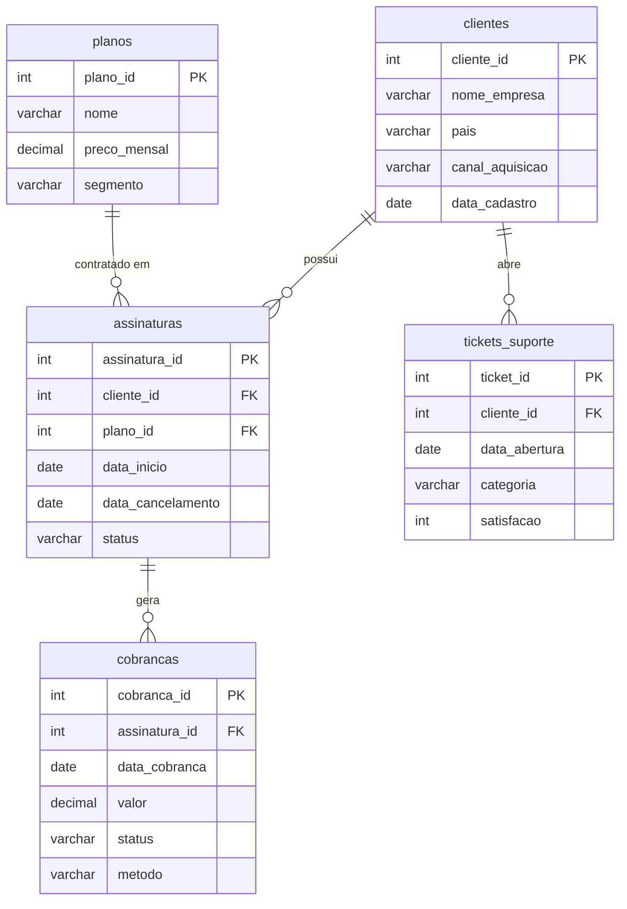

# SQL Responde -  10 perguntas de negócio em uma base de assinaturas (SaaS)

Projeto de estudo em que eu modelo do zero o banco de uma empresa de assinaturas e respondo **10 perguntas de negócio** usando SQL.

O foco aqui não é usar recurso avançado: é mostrar domínio sólido dos comandos que resolvem a maior parte do trabalho real de um analista de dados — `SELECT`, `FROM`, `WHERE`, `JOIN`, `GROUP BY` e `ORDER BY`  e, principalmente, **ler o resultado como negócio, não como tabela**.

Tudo aqui roda: o schema, os dados e as 10 queries foram executados e validados em MySQL.

---

## Modelo de dados



| Tabela | Registros | O que representa |
|---|---|---|
| `planos` | 4 | Starter, Pro, Business e Enterprise |
| `clientes` | 60 | Empresas assinantes, com país e canal de aquisição |
| `assinaturas` | 60 | 42 ativas e 18 canceladas |
| `cobrancas` | 655 | Cobranças recorrentes com status `paga`, `falha` ou `pendente` |
| `tickets_suporte` | 177 | Atendimentos com categoria e nota de satisfação (1 a 5) |

Os dados são fictícios e gerados com semente fixa, então qualquer pessoa que rodar o projeto obtém exatamente os mesmos números. A data de referência do dataset é **2026-09-15**.

---

## As 10 perguntas

| # | Pergunta de negócio | Comandos exercitados | Arquivo |
|---|---|---|---|
| 1 | Quem são os clientes com assinatura ativa hoje e em que plano estão? | `JOIN` (2), `WHERE`, `ORDER BY` | [`01`](https://github.com/automatte/sql-analise-assinaturas/blob/main/01_clientes_ativos_e_seus_planos.sql) |
| 2 | Quantos assinantes ativos e quanto de MRR cada plano gera? | `JOIN`, `WHERE`, `GROUP BY`, `ORDER BY` | [`02`](https://github.com/automatte/sql-analise-assinaturas/blob/main/02_assinantes_e_mrr_por_plano.sql) |
| 3 | Qual canal de aquisição traz mais clientes e qual traz mais receita? | `JOIN` (2), `GROUP BY`, `ORDER BY` | [`03`](https://github.com/automatte/sql-analise-assinaturas/blob/main/03_aquisicao_por_canal.sql) |
| 4 | Quanto de receita foi efetivamente recebida em cada mês? | `WHERE`, `GROUP BY`, `ORDER BY` | [`04`](https://github.com/automatte/sql-analise-assinaturas/blob/main/04_receita_recebida_por_mes.sql) |
| 5 | Quem cancelou, de que plano saiu e quanto tempo ficou na base? | `JOIN` (2), `WHERE`, `ORDER BY` | [`05`](https://github.com/automatte/sql-analise-assinaturas/blob/main/05_clientes_que_cancelaram.sql) |
| 6 | Quantos cancelamentos por mês e quanto de MRR foi perdido? | `JOIN`, `WHERE`, `GROUP BY`, `ORDER BY` | [`06`](https://github.com/automatte/sql-analise-assinaturas/blob/main/06_cancelamentos_por_mes.sql) |
| 7 | Onde a cobrança falha mais: em qual plano e em qual meio de pagamento? | `JOIN` (2), `WHERE`, `GROUP BY` duplo | [`07`](https://github.com/automatte/sql-analise-assinaturas/blob/main/07_falha_de_cobranca_por_plano_e_metodo.sql) |
| 8 | Quais clientes ativos têm cobrança em aberto? | `JOIN` (3), `WHERE` composto, `GROUP BY` | [`08`](https://github.com/automatte/sql-analise-assinaturas/blob/main/08_clientes_ativos_com_pagamento_em_aberto.sql) |
| 9 | Qual o volume de tickets e a satisfação média por categoria? | `WHERE IS NOT NULL`, `GROUP BY`, `ORDER BY` | [`09`]([queries/09_suporte_por_categoria.sql](https://github.com/automatte/sql-analise-assinaturas/blob/main/09_suporte_por_categoria.sql)) |
| 10 | Quais clientes ativos avaliaram o suporte com nota baixa? | `JOIN` (3), `WHERE IN`, `GROUP BY`, `ORDER BY` duplo | [`10`](https://github.com/automatte/sql-analise-assinaturas/blob/main/10_clientes_ativos_em_risco.sql) |

Cada arquivo traz a pergunta, **por que ela importa para o negócio** e a query comentada.

---

## Três leituras que saem desses dados

**O plano do meio carrega a empresa.** O Business responde por 14 dos 42 assinantes ativos (33% da base) e por R$ 12.586 de MRR — quase metade da receita recorrente total. Já o Enterprise gera 27% do MRR com apenas 3 clientes: receita alta e concentração de risco alta na mesma linha.

**Indicação é o canal mais eficiente, não o maior.** Google Ads traz mais clientes (16) e mais MRR total (R$ 9.135), mas Indicação tem ticket médio de R$ 949 contra R$ 571 do Google Ads. Vale menos verba e mais programa de indicação.

**Há receita parada em cima da mesa.** 34 clientes **ativos** acumulam cobranças em aberto, e o topo da lista são contas Enterprise e Business. É churn involuntário: gente que quer continuar e não pagou por falha operacional — recuperável com uma régua de cobrança.

---

## Como rodar

Escrito para **MySQL 8.0+** (testado também em MariaDB 10.11, com `ONLY_FULL_GROUP_BY` ativo).

```bash
mysql -u root -p < schema.sql    # cria o banco saas_demo e as 5 tabelas
mysql -u root -p < seed.sql      # insere os dados
mysql -u root -p saas_demo < queries/02_assinantes_e_mrr_por_plano.sql
```

No Windows, ou para usar com o **PopSQL**, o passo a passo completo está em **[SETUP.md](SETUP.md)**.

Para rodar em PostgreSQL, só duas coisas mudam: `DATE_FORMAT(data, '%Y-%m')` vira `DATE_TRUNC('month', data)` (perguntas 4 e 6) e `DATEDIFF(a, b)` vira `a - b` (pergunta 5).

---

## Estrutura

```
.
├── README.md
├── SETUP.md          # como subir no MySQL e conectar o PopSQL
├── schema.sql        # criação do banco e das 5 tabelas
├── seed.sql          # dados fictícios (semente fixa)
└── queries/          # as 10 perguntas, uma por arquivo
```

---
